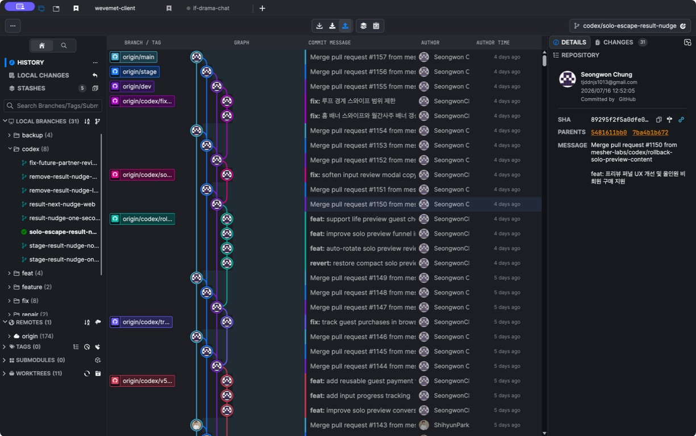
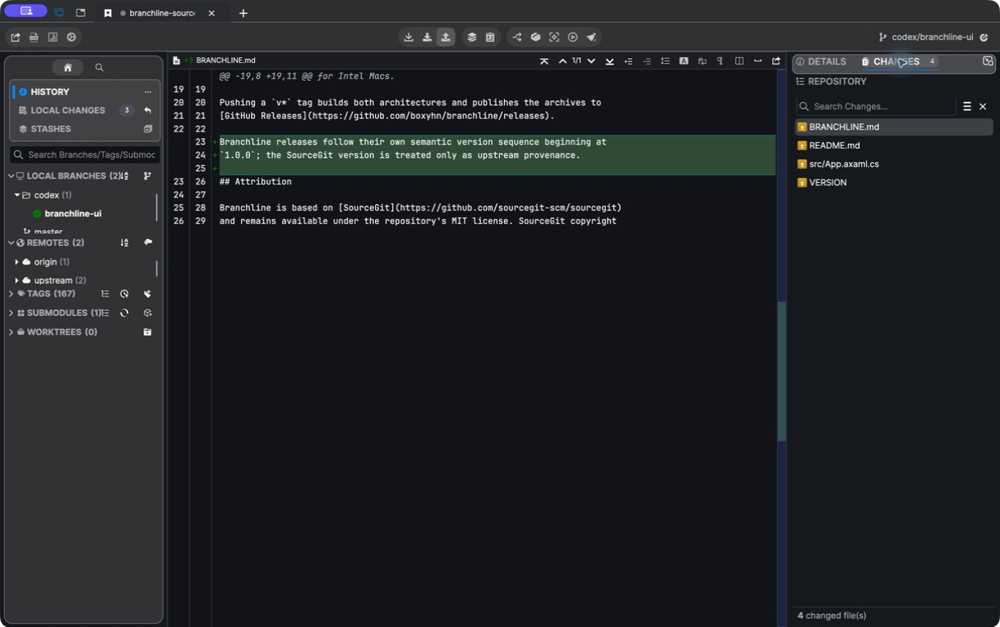

<div align="center">
  

# Branchline

**A visual Git client for macOS that makes dense repository history readable.**

[](https://github.com/boxyhn/branchline/releases/latest)
[](https://github.com/boxyhn/branchline/releases/latest)
[](https://github.com/boxyhn/branchline/releases/latest)
[](LICENSE)

[Download](https://github.com/boxyhn/branchline/releases/latest) · [Release notes](https://github.com/boxyhn/branchline/releases) · [Branchline changes](BRANCHLINE.md)

</div>



Branchline presents branches, graph lanes, commit messages, authors, and
timestamps as one resizable history table. It keeps the graph close to the
commit it explains, so merges and long-running branches can be scanned without
mentally joining separate panels.

## Designed Around History

| Read the graph | Inspect the commit | Keep working |
| --- | --- | --- |
| Compact branch labels sit beside their commits. Colored lanes preserve merge and branch crossings. Author avatars appear directly inside graph nodes. | Details, changed files, and the repository tree share one inspector. Selecting a changed file opens its diff in the main workspace; `Esc` returns to the graph. | Clone, fetch, pull, push, merge, rebase, stash, worktree, blame, submodules, Git LFS, and the rest of SourceGit's mature Git workflows remain available. |

### A History Table You Can Shape

- Resize the branch, graph, commit message, author, and time columns
- Read exact author times instead of vague relative timestamps
- Copy a commit SHA with one click and hover a row to see its full SHA
- Follow merge topology without separating labels from graph nodes
- See GitHub author images in graph nodes and the author column

### Inspection Without Losing Context

- Switch between commit details, changed files, and repository files
- Open a changed file with a single click
- Review large diffs in the full graph workspace instead of a narrow sidebar
- Browse repository files, then press `Esc` to return to history



## Install

Download the build for your Mac from the latest release:

| Mac | Package |
| --- | --- |
| Apple Silicon (M1 or newer) | [`branchline_1.0.2.osx-arm64.zip`](https://github.com/boxyhn/branchline/releases/download/v1.0.2/branchline_1.0.2.osx-arm64.zip) |
| Intel | [`branchline_1.0.2.osx-x64.zip`](https://github.com/boxyhn/branchline/releases/download/v1.0.2/branchline_1.0.2.osx-x64.zip) |

Unzip the archive and move `Branchline.app` to `/Applications`.

Branchline currently ships with an ad-hoc signature rather than Apple
notarization. If macOS blocks the first launch, remove the download quarantine
attribute and open it again:

```bash
xattr -dr com.apple.quarantine /Applications/Branchline.app
open /Applications/Branchline.app
```

**Requirements:** macOS 13 or later and Git 2.25.1 or later. Application data
is stored in `~/Library/Application Support/Branchline`.

<details>
<summary><strong>Build from source</strong></summary>

Install the .NET 10 SDK, then run:

```bash
dotnet publish src/SourceGit.csproj \
  -c Release \
  -o build/Branchline \
  -r osx-arm64

VERSION=$(cat VERSION) \
RUNTIME=osx-arm64 \
bash build/scripts/package.osx-app.sh
```

Use `osx-x64` for an Intel build. Pushing a `v*` tag builds both architectures
and publishes them as a GitHub Release.

</details>

## SourceGit Relationship

Branchline is an independent macOS product built from
[SourceGit](https://github.com/sourcegit-scm/sourcegit). The fork keeps
SourceGit's Git implementation, project history, attribution, and MIT license
while Branchline develops its own product design and release line.

Branchline follows semantic versioning beginning at `1.0.0`. SourceGit version
numbers identify the upstream base only; they are not reused as Branchline
release numbers. The `upstream` remote remains available so mature Git fixes
and features can continue to flow into Branchline.

## License

Branchline is distributed under the [MIT License](LICENSE). SourceGit copyright
and permission notices are preserved in the repository history and license.
